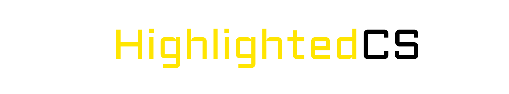

<div align=center>
<p align=center>


<h4>Must-have computer science books with highlights and annotations</h4>
<p> Contribute now </p>

</p>

</div>

>NOTE: Not all the books are highlighted yet! PRs are welcome :)

    

## TOC

```
├── Algorithm
│   ├── Introduction to Algorithms [coremen] (3).pdf
│   └── The Art of Computer Programming [Donald_E._Knuth] (3).pdf
├── Cryptography
│   └── Cryptography and network security [stallings] (5).pdf
├── Database
│   ├── Database Management Systems [Ramakrishnan] (3).pdf
│   ├── Database System Concepts [KORTH] (6).PDF
│   └── Fundamentals of Database Systems [Elmasri, Navathe] (7).pdf
├── Data communication and networking
│   ├── Computer networking a top down aproach [kurose, ross] (6).pdf
│   ├── Data and computer communications [stallings] (8).pdf
│   └── Data communication and networking [forouzan] (4).pdf
├── Data science
│   └── Data mining concepts and techniques [Jiawei Han, Micheline Kamber, Jian Pei] (3).pdf
├── Data structure
│   ├── Data structures algorithm analysis in c++ [mark allen weiss] (4).pdf
│   ├── Data structures and program design in c++ [kruse, ryba] (1) .pdf
│   └── Data structures using c [reema thareja] (2).pdf
├── Digital electronics
│   ├── Digital design [Morris Mano] (5).pdf
│   └── Digital electronics [anil.k.maini] (1).pdf
├── Electronics
│   └── Principles of electronics [V.K Mehta] (1).pdf
├── Garph theory
│   └── Graph theory with applications [C. Vasudev] (1).pdf
├── General concepts
│   └── Computer science distilled [Wladston Ferreira Filho] (1).pdf
├── LICENSE
├── logo.png
├── Microprocessor
│   └── 8085 microprocessors through question answers [S.K.Sen] (2).pdf
├── OOP
│   ├── Object oriented programming in c++ [Robert Lafore] (4).pdf
│   └── Oop with c++ solutoin [E balagurusamy].pdf
├── Operating system
│   └── Operating system A concept-based approach [Dhamdhere] (1).pdf
├── Parallel computing
│   ├── Distributed computing [singhal].pdf
│   └── Distributed systems principles and paradigms [tanenbaum] (2).pdf
├── README.md
├── Software engineering
│   ├── Object oriented software engineering [mc graw hill].pdf
│   ├── Software engineering IIT khargapur [rajib mall].pdf
│   └── Software engineering [sommerville].pdf
├── Theory of computer science
│   ├── Introduction to automata theory [hopcroft, ullman] (2).pdf
│   ├── Theory of automata, formal languages and computation [new age publishers].pdf
│   └── Theory of computer science [klp mishara] (3).pdf
├── Unix
│   └── UNIX and shell programming [oxford university press].pdf
└── Wireless sensor networking
    ├── Fundamentals of wireless sensor networks [Waltenegus Dargie].pdf
    ├── Protocols and architectures for wireless sensor networks [karl, willing].pdf
    ├── Wireless sensor network designs [anna Hac].pdf
    └── Wiress sensors network [Kazem Sohraby, Daniel Minoli, Taieb Znati].pdf

18 directories, 38 files
```
